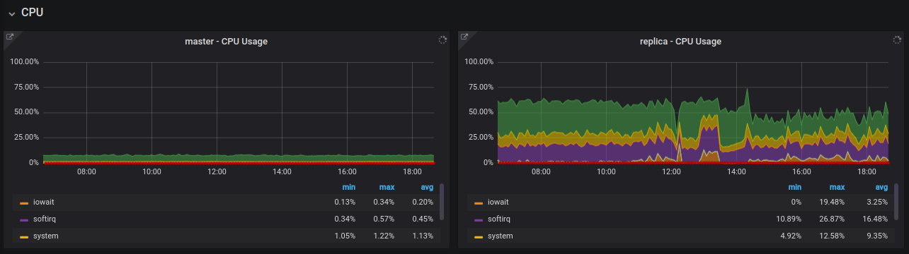
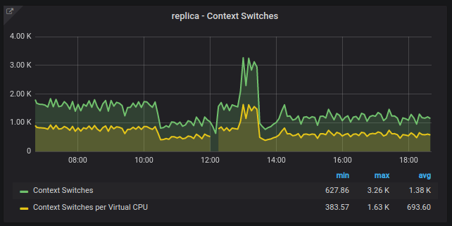
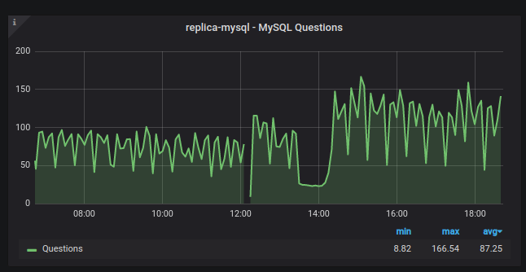
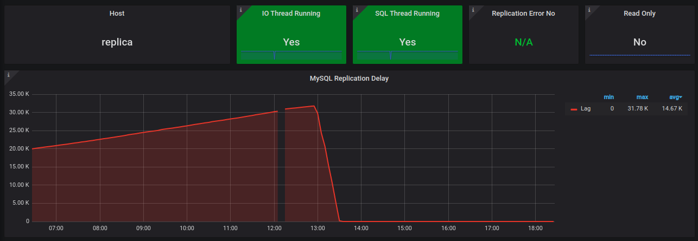
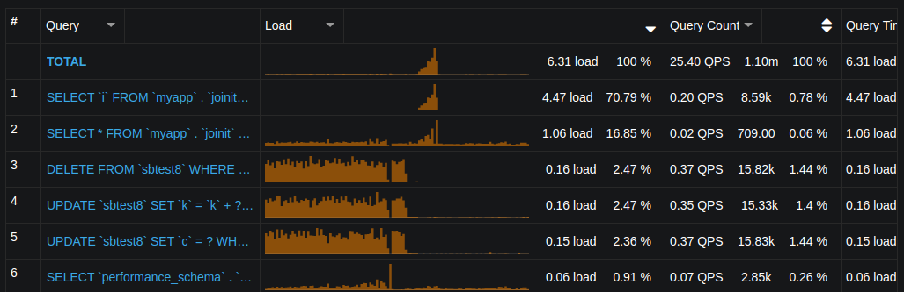
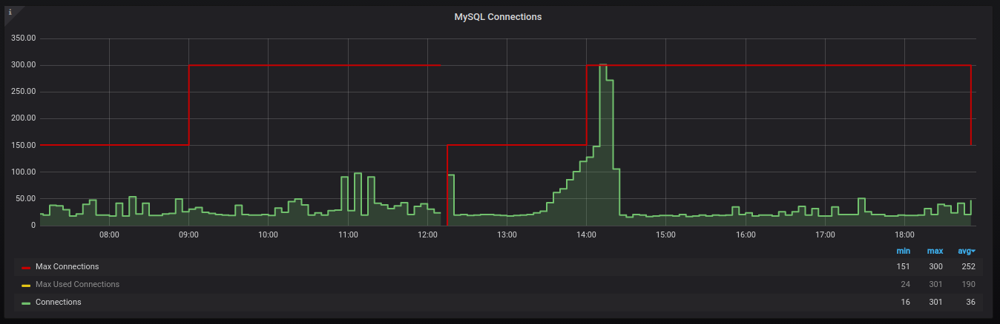

# Analise Terceiro Dia - Desafio Percona

## Relatório

Foi identificado que o principal ponto que causava a lentidão no servidor era o workload que nele estava sendo executado. Foi feito a otimização de três das cinco queries principais.

Após a otimização das mesmas o workload do servidor foi baixado, assim liberando o mesmo para a sincronização da replicação e finalização das conexões.

Abaixo segue os dashboards dos servidores para comparação.

### Dasboards

#### CPU Usage



#### Replica Context Switches



#### Replica Questions



#### Replication Lag



#### Top 5 Queries



#### Replica Connections



## Actions Report

### Seconds_Behind_Master

Foi identificado no servidor o lag crescente informado no e-mail.

```sql
mysql> SHOW SLAVE STATUS\G
*************************** 1. row ***************************
               Slave_IO_State: Waiting for master to send event
              Master_Log_File: master-bin.000022
          Read_Master_Log_Pos: 118688106
               Relay_Log_File: replica-relay-bin.000054
                Relay_Log_Pos: 64974742
        Relay_Master_Log_File: master-bin.000022
             Slave_IO_Running: Yes
            Slave_SQL_Running: Yes
        Seconds_Behind_Master: 26029
      Slave_SQL_Running_State: Reading event from the relay log
           Retrieved_Gtid_Set: 373cd9b1-58c4-11ea-9320-5254008afee6:1-1306264
            Executed_Gtid_Set: 373cd9b1-58c4-11ea-9320-5254008afee6:1-1251953
```

* Foi zerado o lag com a otimização do workload do servidor atuando nas TOP Queries do mesmo.

```sql
mysql> show slave status\G
*************************** 1. row ***************************
               Slave_IO_State: Waiting for master to send event
              Master_Log_File: master-bin.000022
          Read_Master_Log_Pos: 144752212
               Relay_Log_File: replica-relay-bin.000057
                Relay_Log_Pos: 8954863
        Relay_Master_Log_File: master-bin.000022
             Slave_IO_Running: Yes
            Slave_SQL_Running: Yes
        Seconds_Behind_Master: 0
      Slave_SQL_Running_State: Slave has read all relay log; waiting for more updates
           Retrieved_Gtid_Set: 373cd9b1-58c4-11ea-9320-5254008afee6:1-1332618
            Executed_Gtid_Set: 373cd9b1-58c4-11ea-9320-5254008afee6:1-1332618
```

### TOP 5 Queries no servidor replica

```sql
-- 1
SELECT * FROM `myapp` . `joinit` UNION SELECT * FROM `myapp` . `joinit2`;

/*
mysql> explain SELECT * FROM `myapp`.`joinit` UNION SELECT * FROM `myapp`.`joinit2`\G
*************************** 1. row ***************************
           id: 1
  select_type: PRIMARY
        table: joinit
   partitions: NULL
         type: ALL
possible_keys: NULL
          key: NULL
      key_len: NULL
          ref: NULL
         rows: 1044064
     filtered: 100.00
        Extra: NULL
*************************** 2. row ***************************
           id: 2
  select_type: UNION
        table: joinit2
   partitions: NULL
         type: ALL
possible_keys: NULL
          key: NULL
      key_len: NULL
          ref: NULL
         rows: 1043802
     filtered: 100.00
        Extra: NULL
*************************** 3. row ***************************
           id: NULL
  select_type: UNION RESULT
        table: <union1,2>
   partitions: NULL
         type: ALL
possible_keys: NULL
          key: NULL
      key_len: NULL
          ref: NULL
         rows: NULL
     filtered: NULL
        Extra: Using temporary
3 rows in set, 1 warning (0.03 sec)

*/

-- 2
SELECT `i` FROM `myapp` . `joinit2` WHERE `i` IN (...);

/*
mysql> explain select i from myapp.joinit2 where i in (1,2,3,4,5,6,7,8,9,10,11,12,13,14,15,16,17,18,19,20)\G
*************************** 1. row ***************************
           id: 1
  select_type: SIMPLE
        table: joinit2
   partitions: NULL
         type: ALL
possible_keys: NULL
          key: NULL
      key_len: NULL
          ref: NULL
         rows: 1043802
     filtered: 50.00
        Extra: Using where
1 row in set, 1 warning (0.01 sec)

*/

CREATE INDEX idx_i ON myapp.joinit2(i);

/*
mysql> explain select i from myapp.joinit2 where i in (1,2,3,4,5,6,7,8,9,10,11,12,13,14,15,16,17,18,19,20)\G
*************************** 1. row ***************************
           id: 1
  select_type: SIMPLE
        table: joinit2
   partitions: NULL
         type: range
possible_keys: idx_i
          key: idx_i
      key_len: 4
          ref: NULL
         rows: 20
     filtered: 100.00
        Extra: Using where; Using index
1 row in set, 1 warning (0.42 sec)

*/

-- Apesar da criação do indice ter sido eficiente para o numero de linhas
-- utilizadas na query
-- O mesmo se mostrou ineficiente no workload do servidor.
-- A query mudou o tempo de resposta aumentando a duranção da conexão, assim
-- Acumulando o numero de conexões até o maximo permitido no servidor.
-- Foi alterado em tempo de execução o maximo de conexões.

DROP INDEX idx_i ON myapp.joinit2;

-- 3
DELETE FROM `sbtest8` WHERE `id` = ?

/*
mysql> explain DELETE FROM sbtest8 WHERE id=502216\G
*************************** 1. row ***************************
           id: 1
  select_type: DELETE
        table: sbtest8
   partitions: NULL
         type: ALL
possible_keys: NULL
          key: NULL
      key_len: NULL
          ref: NULL
         rows: 986090
     filtered: 100.00
        Extra: Using where
1 row in set (0.00 sec)

*/

ALTER TABLE sysbench.sbtest8 ADD PRIMARY KEY (id);

/*
mysql> explain DELETE FROM sbtest8 WHERE id=502216\G
*************************** 1. row ***************************
           id: 1
  select_type: DELETE
        table: sbtest8
   partitions: NULL
         type: range
possible_keys: PRIMARY
          key: PRIMARY
      key_len: 4
          ref: const
         rows: 1
     filtered: 100.00
        Extra: Using where
1 row in set (0.00 sec)

*/

-- 4
UPDATE `sbtest8` SET `k` = `k` + ? WHERE `id` = ?
explain UPDATE `sbtest8` SET `k` = `k` + 483084 WHERE `id` = 1;

/*
mysql> explain UPDATE `sbtest8` SET `k` = `k` + 483084 WHERE `id` = 1\G
*************************** 1. row ***************************
           id: 1
  select_type: UPDATE
        table: sbtest8
   partitions: NULL
         type: range
possible_keys: PRIMARY
          key: PRIMARY
      key_len: 4
          ref: const
         rows: 1
     filtered: 100.00
        Extra: Using where
1 row in set (0.00 sec)

mysql> SHOW INDEXES FROM sbtest8\G
*************************** 1. row ***************************
        Table: sbtest8
   Non_unique: 0
     Key_name: PRIMARY
 Seq_in_index: 1
  Column_name: id
    Collation: A
  Cardinality: 986400
     Sub_part: NULL
       Packed: NULL
         Null:
   Index_type: BTREE
      Comment:
Index_comment:
*************************** 2. row ***************************
        Table: sbtest8
   Non_unique: 1
     Key_name: k_8
 Seq_in_index: 1
  Column_name: k
    Collation: A
  Cardinality: 193314
     Sub_part: NULL
       Packed: NULL
         Null:
   Index_type: BTREE
      Comment:
Index_comment:
2 rows in set (0.01 sec)
*/

-- 5
UPDATE `sbtest8` SET `c` = ? WHERE `id` = ?
explain UPDATE `sbtest8` SET `c` ='66279278725-55619837129-95438588440-91045437497-61721550742-61179991680-98693015760-91031427011-20851715491-25173287270' WHERE `id` = 1;

/*
mysql> explain UPDATE `sbtest8` SET `c` ='66279278725-55619837129-95438588440-91045437497-61721550742-61179991680-98693015760851715491-25173287270' WHERE `id` = 1\G
*************************** 1. row ***************************
           id: 1
  select_type: UPDATE
        table: sbtest8
   partitions: NULL
         type: range
possible_keys: PRIMARY
          key: PRIMARY
      key_len: 4
          ref: const
         rows: 1
     filtered: 100.00
        Extra: Using where
1 row in set (0.01 sec)

*/

```

### Downtime no servidores replica e master

* No servidor master não houve downtime
* No servidor replica houve um downtime no serviço do mysql (2020-03-28 12:05 - 12:15) durante a validação do uso do swap no servidor.
  * O downtime ocorreu devido as otimizções do workload não terem sido feitas antes da otimização do swap.
  * Com o downtime, foi retornado o valor original para 80 do parametro swappiness

### Ações conclusivas realizadas no servidor master

* Foi alterado o parametro **binlog_group_commit_sync_delay** com o objetivo de aumentar o intervalo que o binlog era atualizado para o SLAVE sincronizar com as modificações antigas.

```sql
Master: binlog_group_commit_sync_delay
SELECT @@GLOBAL.binlog_group_commit_sync_delay\G

mysql> SELECT @@GLOBAL.binlog_group_commit_sync_delay\G
*************************** 1. row ***************************
@@GLOBAL.binlog_group_commit_sync_delay: 0
1 row in set (0.00 sec)

SET GLOBAL binlog_group_commit_sync_delay=10000;

SET GLOBAL binlog_group_commit_sync_delay=0;
```

* Após o sincronismo do SLAVE, foi retornado o parametro para 0.

### Ações conclusivas realizadas no servidor replica

* Desabilitar o transparent hugepages na replica
* Criar a PRIMARY KEY para a tabela sbtest8 que influenciou diretamente em 3 das top queries
* Modificar em tempo de execução o parametro **max_connections** de 151 para 300 para realizar as ações necessárias no servidor
  * O parametro **max_connections** foi alterado somente em tempo de execução em dois momentos:
    * Durante a primera parte da analise até o restart do serviço
    * Após o primeiro **Max Used Connections** após a criação do indice `idx_i` na tabela `myapp.joinit2`. Após o incidente o indice foi removido

### Disable THP

Conforme orientado no [https://bugs.mysql.com/bug.php?id=84003](https://bugs.mysql.com/bug.php?id=84003) e indicado [https://forums.mysql.com/read.php?177,660270,660274#msg-660274](https://forums.mysql.com/read.php?177,660270,660274#msg-660274) foi desabilitado o transparent hugepages do servidor.

```sh
echo "
[Unit]
Description=Disable Transparent Huge Pages (THP)
DefaultDependencies=no
After=sysinit.target local-fs.target
Before=mysqld.service

[Service]
Type=oneshot
ExecStart=/bin/sh -c 'echo never | tee /sys/kernel/mm/transparent_hugepage/enabled > /dev/null'

[Install]
WantedBy=basic.target
" > /etc/systemd/system/disable-transparent-huge-pages.service

sudo systemctl daemon-reload
sudo systemctl start disable-transparent-huge-pages
sudo systemctl enable disable-transparent-huge-pages
```

### Reference links

* [https://thoughts.t37.net/fixing-a-very-lagging-mysql-replication-db6eb5a6e15d](https://thoughts.t37.net/fixing-a-very-lagging-mysql-replication-db6eb5a6e15d)
* [https://dba.stackexchange.com/questions/160207/mysql-replication-lagging-behind-with-log-slave-updates](https://dba.stackexchange.com/questions/160207/mysql-replication-lagging-behind-with-log-slave-updates)
* [https://stackoverflow.com/questions/41134785/how-to-solve-mysql-warning-innodb-page-cleaner-1000ms-intended-loop-took-xxx](https://stackoverflow.com/questions/41134785/how-to-solve-mysql-warning-innodb-page-cleaner-1000ms-intended-loop-took-xxx)
* [https://forums.percona.com/discussion/51846/replication-lag-on-mysql-server-after-increasing-the-number-of-inserts-on-the-master](https://forums.percona.com/discussion/51846/replication-lag-on-mysql-server-after-increasing-the-number-of-inserts-on-the-master)
* [https://bugs.mysql.com/bug.php?id=84003](https://bugs.mysql.com/bug.php?id=84003)
* [https://docs.mongodb.com/manual/tutorial/transparent-huge-pages/](https://docs.mongodb.com/manual/tutorial/transparent-huge-pages/)
